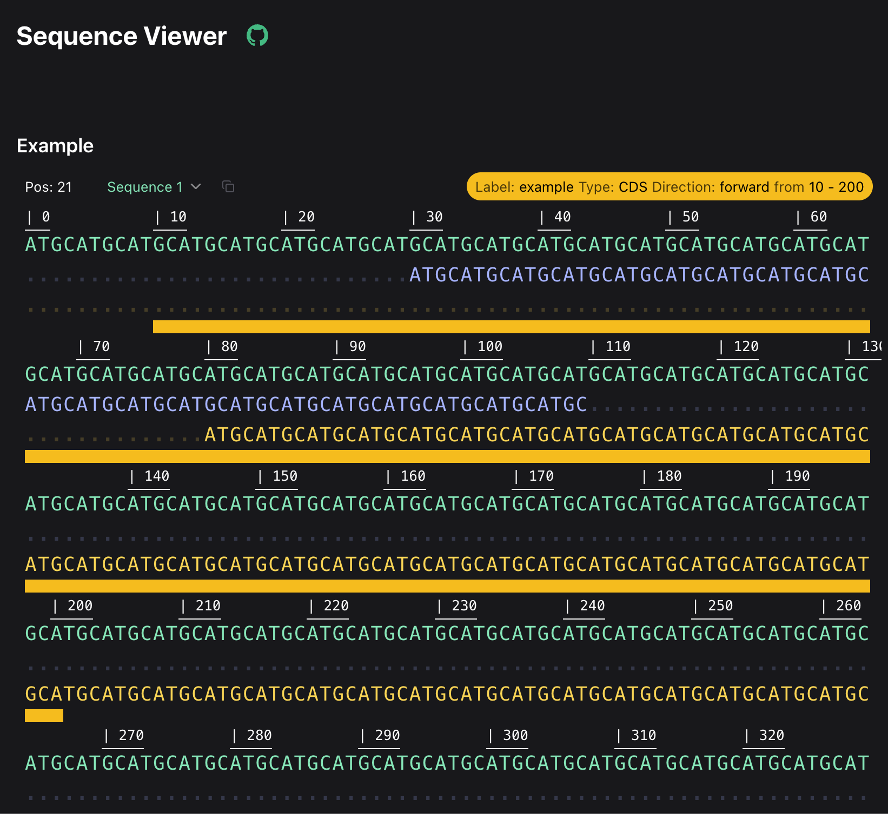

# Nitro Bio Sequence Viewers




## As seen on

- [NVIDIA's Build](https://build.nvidia.com/arc/evo2-40b): playground for ai models
- [Tatta Bio's Gaia](https://gaia.tatta.bio/): embedding based protein search engine
- [EvoScale's Forge](https://forge.evolutionaryscale.ai/): playground for ESM models
- [Nitro Bio's Sequences](https://sequences.nitro.bio/): prompt builder for protein models

## React Components for visualizing linear and circular sequences

### Sequence Viewer

[Documentation](https://docs.nitro.bio/SequenceViewer/)

### Circular Viewer

[Documentation](https://docs.nitro.bio/CircularViewer/)

### Linear Viewer

[Documentation](https://docs.nitro.bio/LinearViewer/)

## Development

### Scripts

This project uses pnpm as the package manager. Here's a list of available scripts:

### Frequently Used in Local dev

- `dev`: Runs Storybook development server on port 6006.
- `format:fix`: Fixes code formatting issues using Prettier.
- `lint:fix`: Fixes linting issues automatically.
- `build`: Lints, builds the project, and generates CSS.
- `build-css`: Builds and minifies Tailwind CSS.
- `test`: Runs tests using Vitest.

### CI

- `build:ci`: Builds the project for CI environments.
- `build-storybook`: Builds Storybook for production.
- `format`: Checks code formatting using Prettier.
- `lint`: Runs TypeScript compiler and ESLint.

### Publishing/Library dev

- `publish`: Publishes the package to NPM.
- `prepublishOnly`: Runs linting, formatting, and build before publishing.
- `build:watch`: Watches for changes and rebuilds the project.
- `test:watch`: Runs tests in watch mode.

### Usage

To run a script, use:

```
pnpm <script-name>
```

For example:

```
pnpm dev
```

This will start the Storybook development server.

## Notable Dependencies

### Frameworks

- React

### Runtime Utilities

- @tanstack/react-query (Data fetching and state management)
- Zod (Schema validation)
- @tanstack/react-table (Table component library)
- React Hook Form (Form handling)

### Buildtime Utilities

- Vite (Build tool and development server)
- TypeScript (Static typing)
- ESLint and Prettier (Code linting and formatting)
- Vitest (Testing framework)
- Storybook (UI component development and documentation)

### Styling

- Tailwind CSS (Utility-first CSS framework)
- DaisyUI (Tailwind CSS component library)
- Radix UI (Accessible UI components)
- Headless UI (Unstyled, accessible UI components)
- Hero Icons (SVG icon set)

### Data Viz

- MolStar (Molecular visualization)
- RDKit (Cheminformatics and machine learning toolkit)
