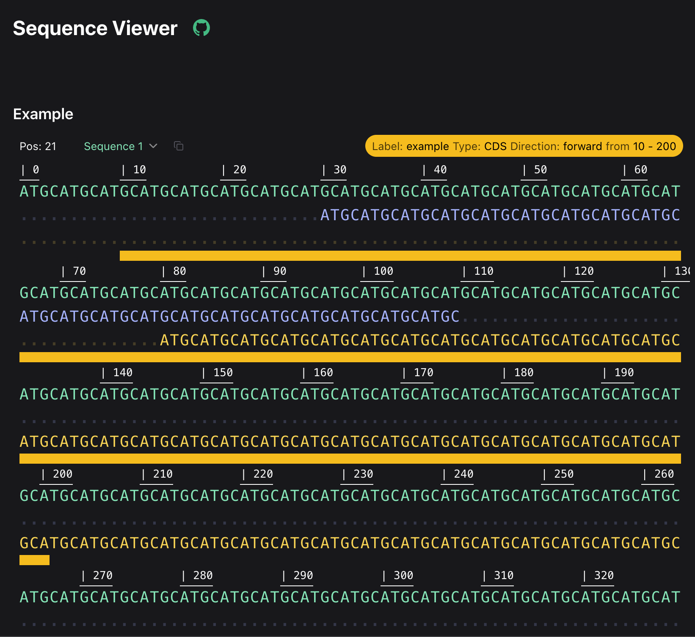

# Nitro Bio Sequence Viewers




## As seen on

- [NVIDIA's Build](https://build.nvidia.com/arc/evo2-40b): playground for ai models
- [Tatta Bio's Gaia](https://gaia.tatta.bio/): embedding based protein search engine
- [EvoScale's Forge](https://forge.evolutionaryscale.ai/): playground for ESM models
- [Nitro Bio's Sequences](https://sequences.nitro.bio/): prompt builder for protein models

## React Components for visualizing linear and circular sequences

Requires React and React DOM 18.2+ or 19.x.

```sh
npm install @nitro-bio/sequence-viewers
```

Import the stylesheet once in your application entry point:

```ts
import "@nitro-bio/sequence-viewers/styles.css";
```

Both previous imports, `@nitro-bio/sequence-viewers/dist/nitro.css` and
`@nitro-bio/sequence-viewers/dist/nitro-sequence-viewers.css`, resolve to the same
stylesheet for compatibility.

The library stylesheet provides component styles without resetting your host
page. **Provide your own application reset if your application needs one.**
Consumers do not need Tailwind installed: this package ships compiled CSS. The
library builds with Tailwind v4 and targets Safari 16.4+, Chrome 111+, and Firefox
128+ ([browser requirements](https://tailwindcss.com/docs/compatibility)).

Library utilities and theme variables use the `nsv` prefix. Caller-provided class
strings are preserved verbatim; define those classes in your own CSS or compile
them with your application's Tailwind configuration. See the
[CSS migration guide](docs/issue-80/css-isolation.md) for theming and portal details.

### Sequence Viewer

[Documentation](https://docs.nitro.bio/SequenceViewer/)

Alignment is an explicit opt-in. Supply both `enableAlignment` and a
`setSequences` callback to show an active Align action:

```tsx
<SequenceViewer
  sequences={sequences}
  setSequences={setSequences}
  enableAlignment
  alignmentConfig={{ urlCDN: "https://assets.example.com/biowasm" }}
  // ...the viewer's other props
/>
```

Omit `alignmentConfig.urlCDN` to load the pinned alignment tool assets from the
Biowasm CDN. See [the alignment deployment guide](./docs/issue-80/alignment.md)
for self-hosting and browser security requirements.

### Circular Viewer

[Documentation](https://docs.nitro.bio/CircularViewer/)

### Linear Viewer

[Documentation](https://docs.nitro.bio/LinearViewer/)

## Rendering and validation

`SequenceViewer` accepts omitted annotations or `annotations={[]}` without
repeating annotation generation on otherwise unchanged input. Empty sequences
render a local empty state with no active copy, download, or alignment operations.
Sequence coordinates and established padding behavior are preserved.

All three viewers validate structure and recover by default. Malformed
annotations are excluded with a local diagnostic; sequence data that cannot be
displayed safely produces a local placeholder. Rendering remains alphabet-agnostic:
validation does not replace residues, change case, or shift coordinates.

Use `validationMode="strict"` when rendering failures should throw. The
`noValidate` prop is deprecated. An explicit `validationMode` always wins;
otherwise `noValidate={true}` maps to recovery, explicit `false` maps to strict,
and omission uses recovery. This is structural validation, not an alphabet
validation bypass. Public parsing helpers retain their documented throwing
behavior, and exported nucleotide/amino-acid schemas remain available for callers
who want to validate alphabets separately.

See the [validation migration guide](docs/issue-80/validation.md) for examples and
regression coverage.

## Optional browser alignment

Alignment is disabled by default. Passing `setSequences` alone does not enable it.
Opt in explicitly and supply an update callback:

```tsx
<SequenceViewer
  sequences={sequences}
  setSequences={setSequences}
  selection={selection}
  setSelection={setSelection}
  charClassName={() => "my-residue"}
  enableAlignment
  alignmentConfig={{ debug: false }}
/>
```

`alignmentConfig` accepts `urlCDN?: string` and `debug?: boolean` (default `false`).
An enabled viewer without an update callback shows a disabled alignment action.
Assets and Aioli initialization remain lazy until an alignment action runs.

By default, alignment fetches executable JavaScript and WebAssembly tool assets
from `https://biowasm.com/cdn/v3`: MAFFT **7.520** (`tbfast`, `dvtditr`) and
Coreutils **8.32** (`cat`), using the locked Aioli **3.2.1** implementation.
Alignment computes locally in a browser worker; sequence input is supplied to that
worker rather than uploaded as an alignment service request. Installing Aioli
from npm does **not** eliminate runtime tool-asset downloads.

For self-hosting, set `alignmentConfig={{ urlCDN: "https://your-host.example/assets" }}`
and serve the complete documented asset directory. See the
[alignment migration and self-hosting guide](docs/issue-80/alignment.md) for the
exact files, browser/CSP/CORS requirements, error/retry behavior, and the distinction
between mocked tests and real browser evidence.

## Development

### Scripts

This project uses pnpm as the package manager. Here's a list of available scripts:

### Frequently Used in Local dev

- `dev`: Runs Storybook development server on port 6006.
- `format:fix`: Fixes code formatting issues using Prettier.
- `lint:fix`: Fixes linting issues automatically.
- `build`: Lints, builds the project, and generates CSS.
- `build-css`: Builds and minifies Tailwind CSS.
- `test`: Runs tests using Vitest.

### CI

- `build:ci`: Builds the project for CI environments.
- `build-storybook`: Builds Storybook for production.
- `format`: Checks code formatting using Prettier.
- `lint`: Runs TypeScript compiler and ESLint.

### Publishing/Library dev

- `publish`: Publishes the package to NPM.
- `prepublishOnly`: Runs linting, formatting, and build before publishing.
- `build:watch`: Watches for changes and rebuilds the project.
- `test:watch`: Runs tests in watch mode.

### Usage

To run a script, use:

```
pnpm <script-name>
```

For example:

```
pnpm dev
```

This will start the Storybook development server.

## Notable Dependencies

### Frameworks

- React

### Runtime Utilities

- @tanstack/react-query (Data fetching and state management)
- Zod (Schema validation)
- @tanstack/react-table (Table component library)
- React Hook Form (Form handling)

### Buildtime Utilities

- Vite (Build tool and development server)
- TypeScript (Static typing)
- ESLint and Prettier (Code linting and formatting)
- Vitest (Testing framework)
- Storybook (UI component development and documentation)

### Styling

- Tailwind CSS (Utility-first CSS framework)
- DaisyUI (Tailwind CSS component library)
- Radix UI (Accessible UI components)
- Headless UI (Unstyled, accessible UI components)
- Hero Icons (SVG icon set)

### Data Viz

- MolStar (Molecular visualization)
- RDKit (Cheminformatics and machine learning toolkit)
